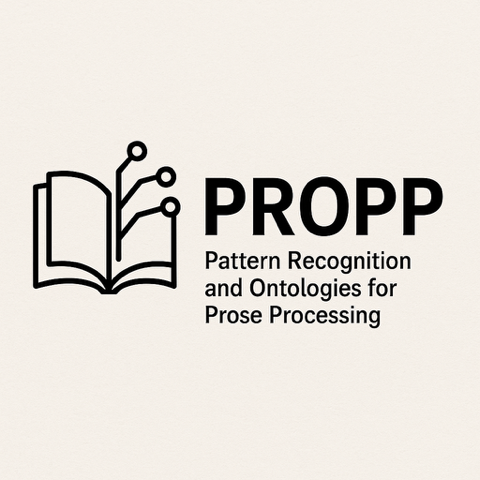

# Propp

Pattern Recognition and Ontologies for Prose Processing

Natural Language Processing Pipeline for French Literary Works

 fr-litBank is licensed under a <a rel="license" href="https://creativecommons.org/licenses/by-sa/4.0/">Attribution-ShareAlike 2.0 France (CC BY-SA 2.0 FR)</a>.

